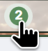

# DMS Screen Off

Screen Off is a tiny [DankMaterialShell](https://danklinux.com/) plugin that turns off monitors.

Inspired by the missing "turn off screen" affordance in the default power controls.




## Features

- DankBar icon with 2-second long press countdown
- Control Center tile with single-click action
- Optional compositor shortcut, disabled by default
- Uses DMS compositor display power management
- Works with the DMS keybind system for supported compositors

## Installation

### Using DMS CLI

```sh
dms plugins install screenOff
```

### Using DMS Settings

1. Open Settings -> Plugins
2. Click "Browse"
3. Enable third party plugins
4. Install and enable Screen Off
5. Add "Screen Off" to your DankBar widgets list

### Manual

1. Clone this repository into your DMS plugins directory:

```sh
git clone https://github.com/SakuraToErii/DmsScreenOff ~/.config/DankMaterialShell/plugins/screenOff
```

2. Open Settings -> Plugins and click "Scan"
3. Enable "Screen Off"
4. Add "Screen Off" to your DankBar widgets list

## Requirements

- DankMaterialShell 1.2.0 or newer
- `dms` CLI available in `PATH`
- A compositor supported by DMS display power management

## Configuration

Settings available in plugin settings:

- **Provider**: DMS keybind provider used for optional shortcut management (default: `niri`)
- **Shortcut**: Optional DMS keybind. Default is empty, so no plugin-managed shortcut is created.

When a shortcut is configured, the plugin writes a provider-specific DMS keybind action.

Clearing the shortcut removes the last keybind managed by this plugin.

## Usage

Add Screen Off from Settings -> Control Center -> Add Widget to use it from Control Center.

Add Screen Off from Settings -> DankBar -> Widgets to use it from DankBar.

DankBar: long press the icon for 2 seconds. The icon shows a `2`, then `1`, then powers off monitors.

Control Center: click the tile.

Press any key or move the mouse to wake the display again.

## About

Screen Off plugin for DankMaterialShell.

### License

MIT
